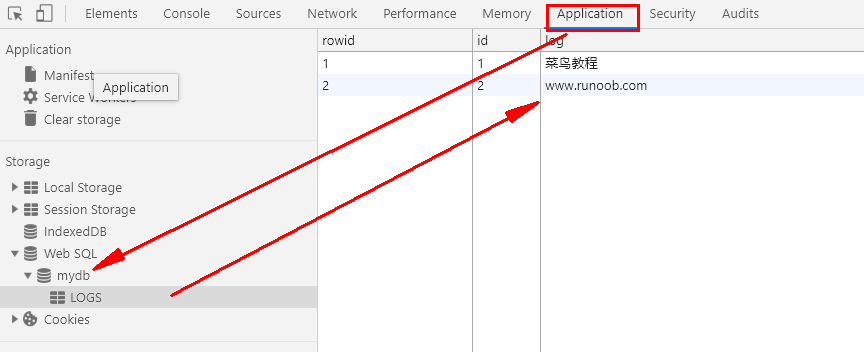

# HTML5

注：验证某个对象(Obj)是否被浏览器支持

```
if(typeof(Obj)!=="undefined")
{
// 是的! 支持 Obj!
// 一些代码.....
} else {
// 抱歉! 不支持 Obj。
}
```

### H5简介

> H5是html的最新新版本，下一代HTML的标椎。

* h5声明方式，较html4版本简单很多

​		`	<!DOCTYPE html>`

 * 新特性
    * 用于绘画的 canvas 元素
   * 用于媒介回放的 video 和 audio 元素
   * 对本地离线存储的更好的支持
   * 新的特殊内容元素，比如 article、footer、header、nav、section
   * 新的表单控件，比如 calendar、date、time、email、url、search

# 新增元素

### 多媒体 video 与 audio

#### video

* 实例：

```html
<video width="500" height="400" controls>
 <source src="movie.mp4" type="video/mp4">
 <source src="movie.ogg" type="video/ogg">
 您的浏览器不⽀持 HTML5 video 标签。
</video>
```

​	注：controls属性提供播放，暂停，和音量控件。

​			source元素连接不同的视频文件，使用第一个被浏览器识别的格式

​			video元素支持三种视频格式： MP4, WebM, 和 Ogg

###  `<video>` 标签的属性

| 属性                                                         | 值       | 描述                                                         |
| ------------------------------------------------------------ | -------- | ------------------------------------------------------------ |
| [autoplay](https://www.w3school.com.cn/tags/att_video_autoplay.asp) | autoplay | 如果出现该属性，则视频在就绪后马上播放。                     |
| [controls](https://www.w3school.com.cn/tags/att_video_controls.asp) | controls | 如果出现该属性，则向用户显示控件，比如播放按钮。             |
| [height](https://www.w3school.com.cn/tags/att_video_height.asp) | *pixels* | 设置视频播放器的高度。                                       |
| [loop](https://www.w3school.com.cn/tags/att_video_loop.asp)  | loop     | 如果出现该属性，则当媒介文件完成播放后再次开始播放。         |
| [preload](https://www.w3school.com.cn/tags/att_video_preload.asp) | preload  | 如果出现该属性，则视频在页面加载时进行加载，并预备播放。如果使用 "autoplay"，则忽略该属性。 |
| [src](https://www.w3school.com.cn/tags/att_video_src.asp)    | *url*    | 要播放的视频的 URL。                                         |
| [width](https://www.w3school.com.cn/tags/att_video_width.asp) | *pixels* | 设置视频播放器的宽度。                                       |

#### `<video>` - 使用 DOM 进行控制

HTML5` <video> `元素同样拥有方法、属性和事件。

| 方法        | 属性        | 事件           |
| ----------- | ----------- | -------------- |
| play()      | currentSrc  | play           |
| pause()     | currentTime | pause          |
| load()      | videoWidth  | progress       |
| canPlayType | videoHeight | error          |
|             | duration    | timeupdate     |
|             | ended       | ended          |
|             | error       | abort          |
|             | paused      | empty          |
|             | muted       | emptied        |
|             | seeking     | waiting        |
|             | volume      | loadedmetadata |
|             | height      |                |
|             | width       |                |

注释：在所有属性中，只有 videoWidth 和 videoHeight 属性是立即可用的。在视频的元数据已加载后，其他属性才可用。[HTML5 Audio/Video DOM 参考手册](https://www.runoob.com/tags/ref-av-dom.html)。

#### [audio使用](https://www.w3school.com.cn/html5/html_5_audio.asp) 

### 新增的input属性	[详细](https://www.w3school.com.cn/html5/html_5_form_input_types.asp)

- email
- url
- number
- range
- Date pickers (date, month, week, time, datetime, datetime-local)
- search
- color


### Canves 画布  [详细](https://www.w3school.com.cn/html5/html_5_canvas.asp)

​       canvas元素用来定义一个画布，js来绘画图形等。

##### 创建canvas

​	` <canvas id="myCanvas" width="200" height="100"></canvas>`

#####        canvas 元素本身是没有绘图能力的。所有的绘制工作必须在 JavaScript 内部完成

```js
<script type="text/javascript">
    //拿到canvas元素
	var c=document.getElementById("myCanvas");
	//创建context对象,getContext("2d") 对象是内建的 HTML5 对象，拥有多种绘制路径、矩形、圆形、字符以	 //及添加图像的方法。
	var cxt=c.getContext("2d");
	//下面的两行代码绘制一个红色的矩形：
	cxt.fillStyle="#FF0000";
	cxt.fillRect(0,0,150,75);
</script>
```

### 内联 SVG [详细](https://www.w3school.com.cn/html5/html_5_svg.asp)


### web存储 [详细1](https://www.w3school.com.cn/html5/html_5_webstorage.asp) [详细2](https://www.runoob.com/html/html5-webstorage.html)

HTML5 web 存储,一个比cookie更好的本地存储方式。

客户端存储数据的两个对象为：

- localStorage - 用于长久保存整个网站的数据，保存的数据没有过期时间，直到手动去除。
  - 只要在相同的协议、相同的主机名、相同的端口下，就能读取/修改到同一份localStorage数据。
- sessionStorage - 用于临时保存同一窗口(或标签页)的数据，在关闭窗口或标签页之后将会删除这些数据。
  - `sessionStorage`比`localStorage`更严苛一点，除了协议、主机名、端口外，还要求在同一**窗口**（也就是浏览器的标签页）下。

##### 不管是 localStorage，还是 sessionStorage，可使用的API都相同，常用的有如下几个（以localStorage为例）：

- 保存数据：localStorage.setItem(key,value);

- 读取数据：localStorage.getItem(key);

- 删除单个数据：localStorage.removeItem(key);

- 删除所有数据：localStorage.clear();

- 得到某个索引的key：localStorage.key(index);

  **注**：键/值对通常以字符串存储，你可以按自己的需要转换该格式。


### web sql [详细](https://www.runoob.com/html/html5-web-sql.html)

> html在迷失的到来上越走越远。。。。。

#### 核心方法

​	以下是规范中定义的三个核心方法：

1. **openDatabase**：这个方法使用现有的数据库或者新建的数据库创建一个数据库对象。
2. **transaction**：这个方法让我们能够控制一个事务，以及基于这种情况执行提交或者回滚。
3. **executeSql**：这个方法用于执行实际的 SQL 查询。




### 应用程序缓存  [详细](https://www.runoob.com/html/html5-app-cache.html)

HTML5 引入了应用程序缓存，这意味着 web 应用可进行缓存，并可在没有因特网连接时进行访问。

应用程序缓存为应用带来三个优势：

1. 离线浏览 - 用户可在应用离线时使用它们
2. 速度 - 已缓存资源加载得更快
3. 减少服务器负载 - 浏览器将只从服务器下载更新过或更改过的资源。

##### 适合spa应用缓存静态资源

manifest 文件可分为三个部分：

- *CACHE MANIFEST* - 在此标题下列出的文件将在首次下载后进行缓存
- *NETWORK* - 在此标题下列出的文件需要与服务器的连接，且不会被缓存
- *FALLBACK* - 在此标题下列出的文件规定当页面无法访问时的回退页面（比如 404 页面）

步骤：

 1. 创建.appcache文件

    ​	CACHE MANIFEST
    ​	 \# 2012-02-21 v1.0.0
    ​	 /theme.css
    ​	 /logo.gif
    ​	 /main.js

    ​	 NETWORK:
    ​	 login.php

    ​	 FALLBACK:
    ​	 /404.html

**提示:**以 "#" 开头的是注释行，但也可满足其他用途。应用的缓存会在其 manifest 文件更改时被更新。如果您编辑了一幅图片，或者修改了一个 JavaScript 函数，这些改变都不会被重新缓存。**更新注释行中的日期和版本号是一种使浏览器重新缓存文件的办法。**

​	


### web worker [阮一峰](http://www.ruanyifeng.com/blog/2018/07/web-worker.html)

> js会创建一个子线称worker去执行任务，子线程与主线程可以通信，两者又互不干扰


#### web  服务器发送事件（server-sent event）

##### Server-Sent 事件 - 单向消息传递

Server-Sent 事件指的是网页自动获取来自服务器的更新。

以前也可能做到这一点，前提是网页不得不询问是否有可用的更新。通过服务器发送事件，更新能够自动到达。

例子：Facebook/Twitter 更新、估价更新、新的博文、赛事结果等。

##### springboot搭建sse demo


