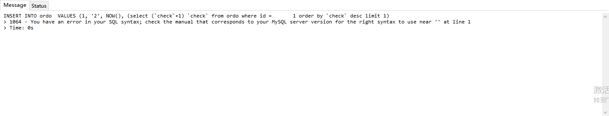

## 问题

##### mysql插入语句时，插入的某个字段的值是一个sql查询出的值？

今天，以前的小伙伴想我问一个问题，本着能装X的就装x的原则，立马给他回了一句so easy！

>  小伙伴的问题描述：
>
> ​	教教我一个插入的mysql语句在插入的时候先判断当前相同ID的总数，然后在插入的时候把这个总数给某个字段值
>
> 我：so easy！！！
>
> ​	我理解的业务是：插入一条记录，与当前插入记录的id相同的其它记录最大的check+1，就是此次插入的check值。理解的有点绕。。。。
>
> 

##### 表结构

问小伙伴要的表结构

``` mysql
SET FOREIGN_KEY_CHECKS=0;

------
-- Table structure for ordo
------

DROP TABLE IF EXISTS `ordo`;
CREATE TABLE `ordo` (
  `Id` int(11) DEFAULT NULL,
  `name` varchar(255) DEFAULT NULL,
  `date` datetime DEFAULT NULL ON UPDATE CURRENT_TIMESTAMP,
  `check` varchar(255) DEFAULT NULL
) ;

------
-- Records of ordo
------

INSERT INTO `ordo` VALUES ('1', '2', '2019-09-25 09:15:31', null);
INSERT INTO `ordo` VALUES ('1', '2', '2019-09-25 09:16:50', null);
INSERT INTO `ordo` VALUES ('2', '2', '2019-09-25 09:18:21', null);
INSERT INTO `ordo` VALUES ('4', '1', '2019-09-25 09:19:10', null);


```

##### 初次实验

YY：这不就是插入的时候找到最后一次插入的check值，然后再+1嘛，so easy。

```mysql
insert into ordo  VALUES (1, '2', NOW(), (select (`check`+1) from ordo where id =	1 order by `check` desc limit 1);
```

然而并没有，讲我sql语法错误。。。



以前是搞c#的，大多数时候用的都是sqlserver，sqlserver这样做的思路没有问题，特意试了一下

```sqlserver
insert into ordo values (1, '2', '2019',(select top 1 (check+1) from ordo))
```

但mysql不认，就想一下某个值不支持sql语句占位，搜索整条记录给你插总行吧

```mysql
INSERT INTO ordo (Id,`name`,date,`check`) SELECT 1, '2', NOW(), ( select (`check`+1) from ordo where id =	1 order by `check` desc limit 1)
```

果然，这样可以插入，差点翻车了，立马给小伙伴发了过去。

仔细想了想，这样还是有问题，怎么能把bug扔给他呢，问题，就是当插入一条新id时，check值为null，+1以后还是null，第一次新id插入时，check应该为1。

解决方法：试了一下直接IFNULL((`check`+1),1),但是不行，所以加了一个MAX函数

```mysql
INSERT INTO ordo (Id,`name`,date,`check`) SELECT 1, '2', NOW(), (select IFNULL(MAX((`check`+1)),1) `check` from ordo where id =	10 order by `check` desc limit 1)
```


莫名的感到繁琐，其实每次插入的check值 = 插入前此id总数+1。

修改如下：

```mysql
INSERT INTO ordo SELECT 1, '2', NOW(), (select (count(*)+1) from ordo where id = 1)
```


##### 总结

问题并不难，不同的sql语言还是有不少区别的。


