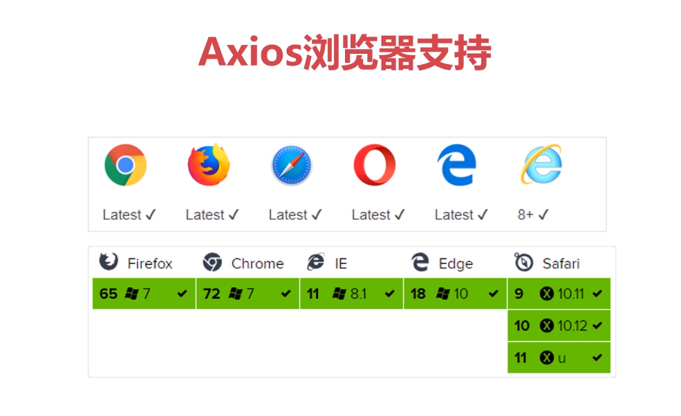

# 1. axios介绍

### 1.  什么是axios

​	1.1 基于[promise](https://www.liaoxuefeng.com/wiki/1022910821149312/1023024413276544)的HTTP库

​	1.2 可用于浏览器和node.js

### 2. axios的特性

​	2.1 支持Promise的API

​	2.2 拦截请求和响应

​	2.3 转换请求数据和响应数据

​	2.4 取消请求

​	2.5 自动转化JSON数据

 	2.6 客户端支持防御XSRF

### 3. axios浏览器支持



 ### 4. 创建vue3.0项目

​	4.1 （1）[创建步骤](https://www.cnblogs.com/qq1272850043/p/9812421.html)

​	4.2 （2）[创建步骤](https://www.cnblogs.com/coober/p/10875647.html)

		* 注意：语法检测工具，一般我选择（ESLint with error prevention only）有语法错误的时候才检查，否则写代码的时候丧心病狂的严格

# 2. axios方法的基本使用

> 这里使用springboot来做axios访问的接口,存在跨域访问问题，配置CorsFilter解决跨域问题

* 注：vue项目以public文件夹为根节点

* 注：一般一个请求会发出两次（调试看），第一次判断接口能不能请求到后端服务，第二次才是真正的去请求

* axios语法

  ```vue
  axios(config)
  别名方式：
  axios.request(config)
  axios.get(url[, config])
  axios.delete(url[, config])
  axios.head(url[, config])
  axios.post(url[, data[, config]])
  axios.put(url[, data[, config]])
  axios.patch(url[, data[, config]])
  ```

* 请求配置项

  下面是创建请求时可用的配置选项，**<font color=red>注意只有 url 是必需的</font>**。如果没有指定 method，请求将默认使用 get 方法

  ```vue
  {
    // `url` 是用于请求的服务器 URL
    url: "/user",
  
    // `method` 是创建请求时使用的方法
    method: "get,post,put,delete", // 默认是 get
  
    // `baseURL` 将自动加在 `url` 前面，除非 `url` 是一个绝对 URL。
    // 它可以通过设置一个 `baseURL` 便于为 axios 实例的方法传递相对 URL
    baseURL: "https://some-domain.com/api/",
  
    // `transformRequest` 允许在向服务器发送前，修改请求数据
    // 只能用在 "PUT", "POST" 和 "PATCH" 这几个请求方法
    // 后面数组中的函数必须返回一个字符串，或 ArrayBuffer，或 Stream
    transformRequest: [function (data) {
      // 对 data 进行任意转换处理
      return data;
    }],
  
    // `transformResponse` 在传递给 then/catch 前，允许修改响应数据
    transformResponse: [function (data) {
      // 对 data 进行任意转换处理
  
      return data;
    }],
  
    // `headers` 是即将被发送的自定义请求头
    headers: {"X-Requested-With": "XMLHttpRequest"},
  
    // `params` 是即将与请求一起发送的 URL 参数
    // 必须是一个无格式对象(plain object)或 URLSearchParams 对象
    params: {
      ID: 12345
    },
  
    // `paramsSerializer` 是一个负责 `params` 序列化的函数
    // (e.g. https://www.npmjs.com/package/qs, http://api.jquery.com/jquery.param/)
    paramsSerializer: function(params) {
      return Qs.stringify(params, {arrayFormat: "brackets"})
    },
  
    // `data` 是作为请求主体被发送的数据
    // 只适用于这些请求方法 "PUT", "POST", 和 "PATCH"
    // 在没有设置 `transformRequest` 时，必须是以下类型之一：
    // - string, plain object, ArrayBuffer, ArrayBufferView, URLSearchParams
    // - 浏览器专属：FormData, File, Blob
    // - Node 专属： Stream
    data: {
      firstName: "Fred"
    },
  
    // `timeout` 指定请求超时的毫秒数(0 表示无超时时间)
    // 如果请求话费了超过 `timeout` 的时间，请求将被中断
    timeout: 1000,
  
    // `withCredentials` 表示跨域请求时是否需要使用凭证
    withCredentials: false, // 默认的
  
    // `adapter` 允许自定义处理请求，以使测试更轻松
    // 返回一个 promise 并应用一个有效的响应 (查阅 [response docs](#response-api)).
    adapter: function (config) {
      /* ... */
    },
  
    // `auth` 表示应该使用 HTTP 基础验证，并提供凭据
    // 这将设置一个 `Authorization` 头，覆写掉现有的任意使用 `headers` 设置的自定义 `Authorization`头
    auth: {
      username: "janedoe",
      password: "s00pers3cret"
    },
  
    // `responseType` 表示服务器响应的数据类型，可以是 "arraybuffer", "blob", "document", "json", "text", "stream"
    responseType: "json", // 默认的
  
    // `xsrfCookieName` 是用作 xsrf token 的值的cookie的名称
    xsrfCookieName: "XSRF-TOKEN", // default
  
    // `xsrfHeaderName` 是承载 xsrf token 的值的 HTTP 头的名称
    xsrfHeaderName: "X-XSRF-TOKEN", // 默认的
  
    // `onUploadProgress` 允许为上传处理进度事件
    onUploadProgress: function (progressEvent) {
      // 对原生进度事件的处理
    },
  
    // `onDownloadProgress` 允许为下载处理进度事件
    onDownloadProgress: function (progressEvent) {
      // 对原生进度事件的处理
    },
  
    // `maxContentLength` 定义允许的响应内容的最大尺寸
    maxContentLength: 2000,
  
    // `validateStatus` 定义对于给定的HTTP 响应状态码是 resolve 或 reject  promise 。如果 `validateStatus` 返回 `true` (或者设置为 `null` 或 `undefined`)，promise 将被 resolve; 否则，promise 将被 rejecte
    validateStatus: function (status) {
      return status &gt;= 200 &amp;&amp; status &lt; 300; // 默认的
    },
  
    // `maxRedirects` 定义在 node.js 中 follow 的最大重定向数目
    // 如果设置为0，将不会 follow 任何重定向
    maxRedirects: 5, // 默认的
  
    // `httpAgent` 和 `httpsAgent` 分别在 node.js 中用于定义在执行 http 和 https 时使用的自定义代理。允许像这样配置选项：
    // `keepAlive` 默认没有启用
    httpAgent: new http.Agent({ keepAlive: true }),
    httpsAgent: new https.Agent({ keepAlive: true }),
  
    // "proxy" 定义代理服务器的主机名称和端口
    // `auth` 表示 HTTP 基础验证应当用于连接代理，并提供凭据
    // 这将会设置一个 `Proxy-Authorization` 头，覆写掉已有的通过使用 `header` 设置的自定义 `Proxy-Authorization` 头。
    proxy: {
      host: "127.0.0.1",
      port: 9000,
      auth: : {
        username: "mikeymike",
        password: "rapunz3l"
      }
    },
  
    // `cancelToken` 指定用于取消请求的 cancel token
    // （查看后面的 Cancellation 这节了解更多）
    cancelToken: new CancelToken(function (cancel) {
    })
  }
  ```

* 响应结构

  axios请求的响应包含以下信息：

  ```
  {
    // `data` 由服务器提供的响应
    data: {},
  
    // `status`  HTTP 状态码
    status: 200,
  
    // `statusText` 来自服务器响应的 HTTP 状态信息
    statusText: "OK",
  
    // `headers` 服务器响应的头
    headers: {},
  
    // `config` 是为请求提供的配置信息
    config: {}
  }
  ```

### 1. 引用axios

​	` import axios from 'axios'`

​	

### 2. 通过向 axios 传递相关配置来创建请求

	> 请求方式
	>
	> 1. get：查询，参数params
	> 2. post：新增，请求参数data
	> 3. put：修改，请求参数data
	> 4. delete：删除，请求参数既可以是params，也可以是data


​	2. 1 get

```vue
 axios({
        url:'http://localhost:8081/api/person',/*请求地址*/
        method:'get',/*请求的方式*/
        timeout:1000,/*超时时间*/
        params:{/*请求参数，在url上*/
          id:1
        }
      }).then(res=>{/*请求成功*/
        console.log(res)
        this.person=res.data
      }).catch(err=>{/*请求失败*/
        console.log(err)
      });
```

​	  别名

```vue
axios.get('http://localhost:8081/api/person',{
        params:{
          id:10
        },
        timeout:1000
      }).then(req=>{
        console.log(req)
      }).catch(err=>{
        console.log(err)
      })
```

​	2.2 post

​	

```vue
 axios({
    url:'http://localhost:8081/api/person',
    method:'post',
    data:person,
    /*timeout:1000*/
  }).then(req=>{
    console.log(req)
  }).catch(err=>{
    console.log(err)
  });

  axios.post("http://localhost:8081/api/person",{
    data:person
  }).then(req=>{
    console.log(req)
  }).catch(err=>{
    console.log(err)
  });
```

​		

​	2.3 put

```
axios({
  url:'http://localhost:8081/api/person',
  method:'put',
  data:person,
  /*timeout:1000*/
}).then(req=>{
  console.log(req)
}).catch(err=>{
  console.log(err)
});

axios.put("http://localhost:8081/api/person",{
  data:person
}).then(req=>{
  console.log(req)
}).catch(err=>{
  console.log(err)
});
```

​	2.4 delete

```
axios({
  url:'http://localhost:8081/api/person',
  method:'delete',
  data:{
    id:10
  },
  /*timeout:1000*/
}).then(req=>{
  console.log(req)
}).catch(err=>{
  console.log(err)
});

axios.delete("http://localhost:8081/api/person",{
  params:{
    id:10
  }
}).then(req=>{
  console.log(req)
}).catch(err=>{
  console.log(err)
});
```

# 3. axios方法深入

### 1. 创建axios的实例

```vue
/*创建axios实例*/
let axios_instance = axios.create({
  baseURL: 'http://localhost:8081/api',
  timeout: 1000
});
/*用实例发出get请求*/
axios_instance.get('/person', {
  params: {
    id: 1
  }
}).then(res => {
  console.log(res)
}).catch(err => {
  console.log(err)
})
```

注：平常直接用axios(config)其实用的是它的默认实例

### 2. 配置全局默认值

```vue
axios.defaults.baseURL = 'https://api.example.com';
axios.defaults.headers.common['Authorization'] = AUTH_TOKEN;
axios.defaults.headers.post['Content-Type'] = 'application/x-www-form-urlencoded';
```

### 3. 自定义实例默认值

```vue
// 在实例已创建后修改默认值
instance.defaults.headers.common['Authorization'] = AUTH_TOKEN;
```

### 4. 拦截器

1. 在请求或响应被then或catch处理前拦截它们。

```vue
// 添加请求拦截器
axios.interceptors.request.use(function (config) {
    // 在发送请求之前做些什么,例如设置请求头的token，加请求弹窗
    return config;
  }, function (error) {
    // 对请求错误做些什么，一般http状态码以4开头 ，401超时，404 not found，405方法不被支持
	// 可以跳到友好的页面
    return Promise.reject(error);
  });

// 添加响应拦截器
axios.interceptors.response.use(function (response) {
    // 对响应数据做点什么，隐藏请求弹框
    return response;
  }, function (error) {
    // 对响应错误做点什么，一般http状态码以5开头，500系统错误，502系统重启
    return Promise.reject(error);
  });
```

2. 如果你想在稍后移除拦截器，可以这样

```vue
var myInterceptor = axios.interceptors.request.use(function () {/*...*/});
axios.interceptors.request.eject(myInterceptor);
```

3. 可以为自定义 axios 实例添加拦截器

```vue
var instance = axios.create();
instance.interceptors.request.use(function () {/*...*/});
```

4. 取消请求（很少用）

```vue
const CancelToken = axios.CancelToken;
const source = CancelToken.source();

axios.get('/user/12345', {
  cancelToken: source.token
}).catch(
  err => {
    if (axios.isCancel(err)) {
      console.log('Request canceled', err.message);
    } else {
      // 处理错误
    }
  });

// 取消请求（message 参数是可选的）
source.cancel('Operation canceled by the user.');
```

### 5.请求时使用 application/x-www-form-urlencoded

axios 会默认序列化 JavaScript 对象为 JSON。 如果想使用 application/x-www-form-urlencoded 格式，你可以使用下面的配置。

content-type：

​	application/json : json数据提交

​	application/x-www-form-urlencoded： 表单数据提交

**浏览器**

在浏览器环境，你可以使用 URLSearchParams API：

```vue
const params = new URLSearchParams();
params.append('param1', 'value1');
params.append('param2', 'value2');
axios.post('/foo', params);
```

# 4. 异步加载

### 1. 语法 & API

你可以使用全局对象方式 Vue.http 或者在一个 Vue 实例的内部使用  this.$http来发起 HTTP 请求。

```vue
// 基于全局Vue对象使用http
Vue.http.get('/someUrl', [options]).then(successCallback, errorCallback);
Vue.http.post('/someUrl', [body], [options]).then(successCallback, errorCallback);

// 在一个Vue实例内使用$http
this.$http.get('/someUrl', [options]).then(successCallback, errorCallback);
this.$http.post('/someUrl', [body], [options]).then(successCallback, errorCallback);
```

vue-resource 提供了 7 种请求 API(REST 风格)： 

```vue
get(url, [options])
head(url, [options])
delete(url, [options])
jsonp(url, [options])
post(url, [body], [options])
put(url, [body], [options])
patch(url, [body], [options])
```

除了 jsonp 以外，另外 6 种的 API 名称是标准的 HTTP 方法。

options 参数说明:

| 参数        | 类型                           | 描述                                                         |
| ----------- | ------------------------------ | ------------------------------------------------------------ |
| url         | `string`                       | 请求的目标URL                                                |
| body        | `Object`, `FormData`, `string` | 作为请求体发送的数据                                         |
| headers     | `Object`                       | 作为请求头部发送的头部对象                                   |
| params      | `Object`                       | 作为URL参数的参数对象                                        |
| method      | `string`                       | HTTP方法 (例如GET，POST，...)                                |
| timeout     | `number`                       | 请求超时（单位：毫秒） (`0`表示永不超时)                     |
| before      | `function(request)`            | 在请求发送之前修改请求的回调函数                             |
| progress    | `function(event)`              | 用于处理上传进度的回调函数 ProgressEvent                     |
| credentials | `boolean`                      | 是否需要出示用于跨站点请求的凭据                             |
| emulateHTTP | `boolean`                      | 是否需要通过设置`X-HTTP-Method-Override`头部并且以传统POST方式发送PUT，PATCH和DELETE请求。 |
| emulateJSON | `boolean`                      | 设置请求体的类型为`application/x-www-form-urlencoded`        |

通过如下属性和方法处理一个请求获取到的响应对象：

| 属性       | 类型                       | 描述                                                |
| ---------- | -------------------------- | --------------------------------------------------- |
| url        | `string`                   | 响应的 URL 源                                       |
| body       | `Object`, `Blob`, `string` | 响应体数据                                          |
| headers    | `Header`                   | 请求头部对象                                        |
| ok         | `boolean`                  | 当 HTTP 响应码为 200 到 299 之间的数值时该值为 true |
| status     | `number`                   | HTTP 响应码                                         |
| statusText | `string`                   | HTTP 响应状态                                       |
| **方法**   | **类型**                   | **描述**                                            |
| text()     | `约定值`                   | 以字符串方式返回响应体                              |
| json()     | `约定值`                   | 以格式化后的 json 对象方式返回响应体                |
| blob()     | `约定值`                   | 以二进制 Blob 对象方式返回响应体                    |


# 参考：

>mooc：axios在vue中的应用
>
>菜鸟教程

