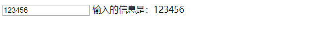
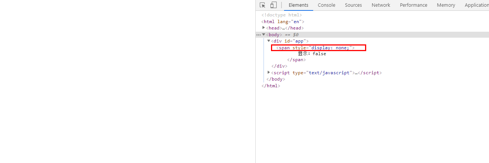
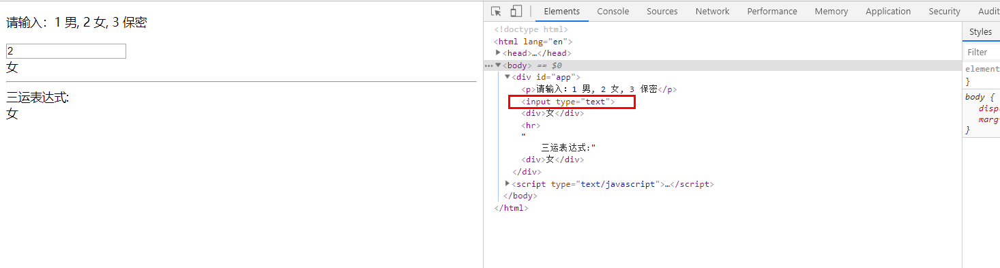
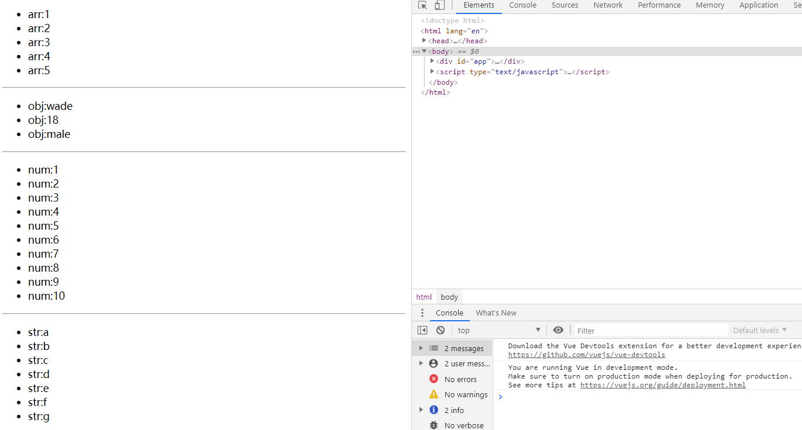

# vue基础语法

### vue第一个实例

##### 步骤

1. 导入Vue.js文件

   ```
   <script src="https://cdn.jsdelivr.net/npm/vue/dist/vue.js"></script>
   ```

2. 创建vue所管理的作用域

   ```html
    <div id="app">
           {{introduction}}
    </div>
   ```

   

3. 创建Vue实例

   ```javascript
   <script type="text/javascript">
           new Vue({
              el:"#app",
              data:{
                  introduction:"hello vue"
              }
           });
   </script>
   ```

这样就创建了一个Vue应用，现在数据和DOM就建立了关联，数据改变，DOM也会跟着变化，不用再通过js去操作DOM，简直不要太爽。

除了文本插值{{}}，也可以这样绑定元素

```vue
<div id="app">
    <span v-bind:title="message">
        鼠标悬停查看提示
    </span>
</div>
```

```vue
<script type="text/javascript">
    new Vue({
        el: "#app",
        data: {
            message: '页面加载于' + new Date().toLocaleString()
        }
    });
</script>
```

上面实例中v-bind 是指令，带有前缀**v- **的字符称为指令。

v-bind:title="message" ：将这个元素的title属性和Vue实例的message属性保持一致，数据改变，dom也会改变。

**vue实例中data的属性用来改变dom结构，前提是要绑定到dom元素中**。view会监测data数据的变化而变化。

### view指令

> 以数据驱动dom结构，简化dom操作
>
> **所有的 DOM 操作都由 Vue 来处理，你编写的代码只需要关注逻辑层面即可**

1. {{}} 插值表达式，model中的数据变化，view也会变化，单向，model---->view
2. v-text:左右与{{}}相同，但v-text绑定在元素上
3. v-html:绑定到元素上，浏览器会解析html标签

实例

```vue
 <span v-text="text"></span>

 <div v-html="html"></div>
```


```vue
new Vue({
    el: "#app",
    data: {
        text:"v-text指令",
        html:"<font color=\"red\">红色字体</font>"
    }
});
```

注：v-text与v-html并没有绑定到某个特定的属性上，而是直接 **=“data中的属性”**，测试绑定在元素的content属性上也ok，但感觉没必要，因为v-text或者v-html指令，是将data中属性的值放在被绑定元素的内容中。

4. v-model：双向绑定，一般用于input标签或能与用户交互的元素上.

    `v-model` 指令在表单 `<input>`、`<textarea>` 及 `<select>` 元素上创建双向数据绑定。它会根据控件类型自动选取正确的方法来更新元素。

```html
<input type="text" v-model="message"/>
<span>输入的信息是：{{message}}</span>
```

```javascript
new Vue({
        el: "#app",
        data: {
            message:''
        }
    });
```

当向输入框中输入数据时，span元素的信息也会跟着变，即view变化，data也跟变化，达到了双向绑定的目的。




5. v-show：根据表达式之真假值，切换元素的 `display` CSS 属性。

   

   左边界面空白，没有显示，但dom元素中依然有此元素，只是设置了元素的display属性为none

   

6. v-if ： 根据表达式的值的真假条件渲染元素，如果为假（false|undefined|null|NaN|+-0|‘ ‘）则dom中没又此元素

7. v-else：不需要表达式，但前一兄弟元素必须有 `v-if` 或 `v-else-if`。

8. v-else-if：前一兄弟元素必须有 `v-if` 或 `v-else-if`

   ```html
   	<p>请输入：1 男, 2 女, 3 保密</p>
       <input type="text" v-model="sex"/>
       <div v-if="sex==='1'">男</div>
       <div v-else-if="sex==='2'">女</div>
       <div v-else>保密</div>
       <hr/>
       三运表达式:<div v-text="sex==='1'?'男':((sex==='2')?'女':'保密')"></div>
   ```

   ```vue
    let app = new Vue({
           el: "#app",
           data: {
               sex: '1',//
           }
       });
   ```

   


 注：dom中并不存在其他if分支的元素，因此if相关指令并不会渲染绑定值为假的元素

9. v-for

   Array | Object | number | string | Iterable (2.6 新增)

   基于源数据多次渲染元素或模板块。

   为当前遍历的元素提供别名：

   ```
   <div v-for="item in items">
     {{ item.text }}
   </div>
   ```

   另外也可以为数组索引指定别名 (或者用于对象的键)：

   ```
   <div v-for="(item, index) in items"></div>
   <div v-for="(val, key) in object"></div>
   <div v-for="(val, name, index) in object"></div>
   ```

   `v-for` 默认行为试着不改变整体，而是替换元素。迫使其重新排序的元素，你需要提供一个 `key` 的特殊属性：

   ```
   <div v-for="item in items" :key="item.id">
     {{ item.text }}
   </div>
   ```

   从 2.6 起，`v-for` 也可以在实现了[可迭代协议](https://developer.mozilla.org/zh-CN/docs/Web/JavaScript/Reference/Iteration_protocols#可迭代协议)的值上使用，包括原生的 `Map` 和 `Set`。不过应该注意的是 Vue 2.x 目前并不支持可响应的 `Map` 和 `Set` 值，所以无法自动探测变更。

   当和 `v-if` 一起使用时，`v-for` 的优先级比 `v-if` 更高。详见[列表渲染教程](https://cn.vuejs.org/v2/guide/list.html#v-for-with-v-if)

```html
	<ul>
        <li v-for="item in arr"> arr:{{item}}</li>
    </ul>
    <hr/>
    <ul>
        <li v-for="o in obj">obj:{{o}}</li>
    </ul>
    <hr/>
    <ul>
        <li v-for="i in num">num:{{i}}</li>
    </ul>
    <hr/>
    <ul>
        <li v-for="s in str">str:{{s}}</li>
    </ul>
    <hr/>
```


```vue
let app = new Vue({
        el: "#app",
        data: {
            arr:[1,2,3,4,5],
            obj:{name:'wade',age:18,sex:'male'},
            num:10,
            str:'abcdefg',
        }
    });
```


结果：




