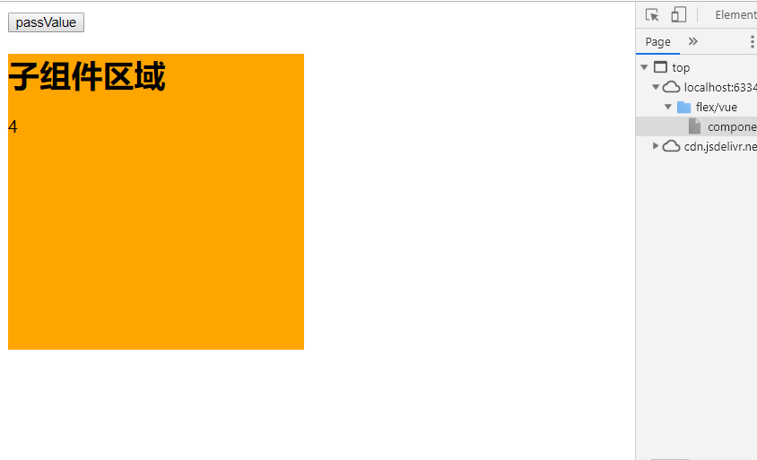

# 组件

> 组件（Component）,其实就是将html分成独立的模块，在项目之间可以重复利用，减少代码的重复编写，提高开发效率.
>
> **组件是可复用的vue实例**：所以它们与 `new Vue` 接收相同的选项，例如 `data`、`computed`、`watch`、`methods` 以及生命周期钩子等。仅有的例外是像 `el` 这样根实例特有的选项。

### 规则：

1. 组件命名分两种
   1. kebab-case(建议使用这种)

   ```vue
   Vue.component('my-component-name', { /* ... */ })
   ```

   ​	当使用 kebab-case (短横线分隔命名) 定义一个组件时，你也必须在引用这个自定义元素时使用 kebab-case，例如 

   ```html
   <my-component-name>。
   ```

   2. PascalCase(不介绍了，记住上面的就行了)


2. **组件中的data必须是一个函数，否则多个组件会共用data中的数据，而函数是返回对象的独立拷贝。**


### 全局组件注册，可以用在任何新创建的 Vue 根实例 (`new Vue`) 的模板中。

demo：点击按钮，count加1

**可以直接在页面上使用**

```html
<div id="app">
    <button-counter></button-counter>
</div>
```

```vue
 Vue.component('button-counter', {
        data: function () {
            return {
                count: 0,
            }
        },
        template: `<div>
                        <p>{{count}}</p>
                        <button @click="add">点击+1</button>
                   </div>`,
        methods: {
            add: function () {
                this.count++;
            }
        }
    });
```

**也可以在vue实例的template属性中使用**

```vue
 Vue.component('button-counter', {
        data: function () {
            return {
                count: 0,
            }
        },
        template: `<div>
                        <p>{{count}}</p>
                        <button @click="add">点击+1</button>
                   </div>`,
        methods: {
            add: function () {
                this.count++;
            }
        }
    });
    let app = new Vue({
        el: '#app',
        data: {},
		//这里使用
        template:`<button-counter></button-counter>`
    })
```


### 局部注册

1. 声明

   ```vue
   var headerComponent = {
           template: `<div> header </div>`,
       };
   ```

2. 注册

   ```vue
    let app = new Vue({
           el: '#app',
           data: {},
           components: {
               'header-component': headerComponent
           },
       })
   ```

   > 对于 `components` 对象中的每个属性来说，其属性名就是自定义元素的名字，其属性值就是这个组件的选项对象。

3. 使用

   ```html
   <div id="app">
       <header-component></header-component>
   </div>
   ```

   

注意**局部注册的组件在其子组件中不可用**。例如，如果你希望 `ComponentA` 在 `ComponentB` 中可用，则你需要这样写：即在component中再声明一个componet

```vue
var ComponentA = { /* ... */ }

var ComponentB = {
  components: {
    'component-a': ComponentA
  },
  // ...
}
```


###  父往子组件传值

通过Prop属性传值

> Prop 是你可以在组件上注册的一些自定义特性。当一个值传递给一个 prop 特性的时候，它就变成了那个组件实例的一个属性。

1. 子组件：props中，声明一个用于接受父组件传递过来值得属性（parentValue）

```vue
 Vue.component('button-counter', {
        props:['parentValue'],
        template: `<div style="height: 300px;width: 300px;background-color: orange">
                        <h1>子组件区域</h1>
                        <p>{{parentValue}}</p>
                   </div>`,
    });
```

2. 在使用子组件时，将1中声明的属性('parentValue')绑定父组件要传递的值count

   ```vue
       let app = new Vue({
           el: '#app',
           data: {
               count: 0
           },
           methods: {
               passValue() {
                   this.count++;
               }
           },
           template: `
               <div>
                   <button @click="passValue">passValue</button>
                   //重点在这
                   <button-counter v-bind:parentValue="count"></button-counter>
               </div>
           `,
       })
   ```

> 一个组件默认可以拥有任意数量的 prop，任何值都可以传递给任何 prop。




### 子组件往父传值

通过子组件触发父组件自定义事件来传值

1. 在使用子组件的元素上自定义事件

   ```vue
   <button-counter @receive="addCount"></button-counter>
   ```

2. 在子组件去触发1中自定义的事件

   ```vue
   <button @click="$emit('receive','hello parentComponent')">传值</button>
   ```

3. 完整实例

   ```vue
    Vue.component('button-counter', {
           template: `<div style="height: 300px;width: 300px;background-color: orange">
                           <h1>子组件区域</h1>
                           <button @click="$emit('receive','hello parentComponent')">传值</button>
                      </div>`,
           methods: {
               passValue() {
                   this.$emit('receive','hello parentComponent')
               }
           }
       });
   
       let app = new Vue({
           el: '#app',
           data: {
               count: 0
           },
           methods: {
               addCount(val) {
                   this.count=val;
               }
           },
           template: `
               <div>
                   <p>父组件count：{{count}}</p>
                   <button-counter @receive="addCount"></button-counter>
               </div>
           `,
       })
   ```

   就两步：

    1. 在子组件元素上自定义事件，这个事件可以处理一些逻辑

    2. 在子组件中定义能够提交父组件中自定义的事件

       ```vue
       this.$emit('自定义事件名','arg0')
       ```

### 非父子组件之间传值

> 非父子之间的通信类似子组件往父组件通信，通过创建空的Vue实例来作为中央事件总线

1. 创建空的Vue实例，用来传递事件与接收事件

   ```vue
   let $bus=new Vue();
   ```

2. 自己理解

   ```vue
   let headerComponent = {
           template: `<div>
                            头部内容
                            <button @click="sendToFooter">向底部传递数据</button>
                       </div>`,
           methods: {
               sendToFooter() {
   				//1.
                   $bus.$emit('dataInHeader', '头部数据');
               }
           }
       };
   
       let footerComponent = {
           template: `<div>底部内容--->来自头部的数据：<span>{{msg}}</span></div>`,
           data: function () {
               return {
                   msg: ''
               }
           },
           created() {
               let that = this;
   			//2.
               $bus.$on('dataInHeader', function (val) {
                   that.msg = val;
               })
           }
       };
   
       let app = new Vue({
           el: '#app',
           components: {
               'header-component': headerComponent,
               'footer-component': footerComponent
           },
           template: `
               <div>
                   <header-component></header-component>
                   <footer-component></footer-component>
               </div>
           `,
       })
   ```

   

