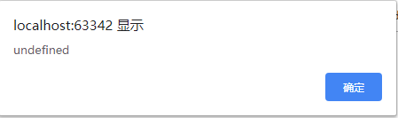
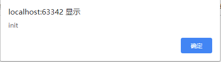

vue的声明周期

> **每个 Vue 实例在被创建时都要经过一系列的初始化过程**——例如，需要设置数据监听、编译模板、将实例挂载到 DOM 并在数据变化时更新 DOM 等。同时在这个过程中也会运行一些叫做**生命周期钩子**的函数，这给了用户在**不同阶段添加自己的代码的机会**。

### 上面重点讲了两点

1. vue实例被创建时经过一系列的初始化过程
2. 在这些初始化过程中可以加入我们自己的代码


### 生命周期图


> 1. 所有的生命周期钩子自动绑定 `this` 上下文到实例中，因此你可以访问数据，对属性和方法进行运算。
> 2. 不要在选项属性或回调上使用[箭头函数](https://developer.mozilla.org/zh-CN/docs/Web/JavaScript/Reference/Functions/Arrow_functions)
>    * 因为箭头函数并没有 `this`，`this`会作为变量一直向上级词法作用域查找，直至找到为止，经常导致 `Uncaught TypeError: Cannot read property of undefined` 或 `Uncaught TypeError: this.myMethod is not a function` 之类的错误。


### beforeCreate(实例/组件 被创建之前)

在实例初始化之后，数据观测 (data observer) 和 event/watcher 事件配置之前被调用。

```vue
let app = new Vue({
        el: '#app',
        data: {
            msg:'init'
        },
        methods: {
        },
        beforeCreate(){
            alert(this.msg)
        }
    })
```

测试结果：this.msg还没有给值



### created(实例/组件 被创建之后)

在实例创建完成后被立即调用。在这一步，实例已完成以下的配置：数据观测 (data observer)，属性和方法的运算，watch/event 事件回调。然而，挂载阶段还没开始，`$el` 属性目前不可见。

```vue
created(){
            alert(this.msg)
        }
```


测试结果：this.msg已被赋值




### beforeMount(组件dom被 挂载/渲染 之前)

在挂载开始之前被调用：相关的 `render` 函数首次被调用。

**该钩子在服务器端渲染期间不被调用。**


### mounted（组件dom被 挂载/渲染 之后）

`el` 被新创建的 `vm.$el` 替换，并挂载到实例上去之后调用该钩子。如果 root 实例挂载了一个文档内元素，当 `mounted` 被调用时 `vm.$el` 也在文档内。

注意 `mounted` **不会**承诺所有的子组件也都一起被挂载。如果你希望等到整个视图都渲染完毕，可以用 [vm.$nextTick](https://cn.vuejs.org/v2/api/#vm-nextTick) 替换掉 `mounted`：


### beforeUpdate（数据被更新时调用）

数据更新时调用，发生在虚拟 DOM 打补丁之前。这里适合在更新之前访问现有的 DOM，比如手动移除已添加的事件监听器。

**该钩子在服务器端渲染期间不被调用，因为只有初次渲染会在服务端进行。**


### update（数据被更新后调用）

由于数据更改导致的虚拟 DOM 重新渲染和打补丁，在这之后会调用该钩子。


### activated

keep-alive 组件激活时调用。


### deactivated

keep-alive 组件停用时调用。


### beforeDestory

实例销毁之前调用。在这一步，实例仍然完全可用


### destory

Vue 实例销毁后调用。调用后，Vue 实例指示的所有东西都会解绑定，所有的事件监听器会被移除，所有的子实例也会被销毁。


### errorCaptured

当捕获一个来自子孙组件的错误时被调用。此钩子会收到三个参数：错误对象、发生错误的组件实例以及一个包含错误来源信息的字符串。此钩子可以返回 `false` 以阻止该错误继续向上传播。


