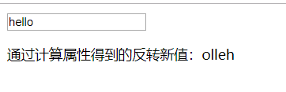
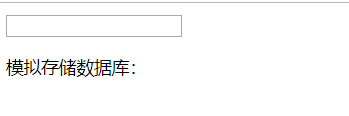
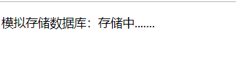
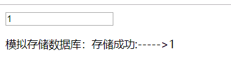

# 计算属性和监听器

### 计算属性 computed

理解：计算属性用来处理当某个绑定的数据属性改变时要处理的复杂逻辑。

> 1. 对于任何复杂逻辑，你都应当使用**计算属性**。
> 2. **计算属性是基于它们的响应式依赖进行缓存的**。只在相关响应式依赖发生改变时它们才会重新求值。
>    * 即只有当被绑定的数据发生改变时，计算属性才会重新计算

#### 实例

```html
<div id="app">
    <input type="text" v-model="msg"/>
    <p>通过计算属性得到的反转新值：{{newMsg}}</p>
</div>
```

```vue
 let app = new Vue({
        el: '#app',
        data: {
            msg: ''
        },
        computed: {
            newMsg: function () {
                return this.msg.split('').reverse().join('');
            }
        }
    })
```



注：如何msg的值没有改变，多次调用newMsg是不会重新计算值得。如果需用，请用方法去处理此处的业务逻辑。

##### computed与methods的区别

| 计算属性computed                 | 方法methods        |
| -------------------------------- | ------------------ |
| 有缓存，被迫执行，必须要有返回值 | 没有缓存，主动触发 |


### 侦听器 watch

> 和computed类似，当有一些数据需要随着其他数据变动而变动时，可以用watch。但如果只是这样，建议使用computed。
>
> 当需要在数据变化时执行异步或开销较大的操作时，这个方式是最有用的。


| computed(计算属性)           | watch(侦听属性)           |
| ---------------------------- | ------------------------- |
| 计算属性可以同时监控多个data | watch只能一个一个监控data |

watch监听的是**一个data属性的值**改变时，尽量去做**非属性操作**或是执行异步操作或者开销较大的操作，没有返回值。

#### 实例

​	模拟当某个数据发生变化后执行异步操作

```html
<div id="app">
    <input :class="{active:isNotActive}" type="text" v-model="msg"/>
    <p>模拟存储数据库：{{promptMsg}}</p>
</div>
```

```vue
<script type="text/javascript">
    let app = new Vue({
        el: '#app',
        data: {
            msg: '',
            promptMsg: '',
            isNotActive: false
        },
        watch: {
            msg: function (newVal, oldVal) {
                this.isNotActive = true;
                this.promptMsg = '存储中.......';
                let that = this;
                setTimeout(function () {
                    that.promptMsg = '存储成功:' + oldVal + '----->' + newVal;
                    that.isNotActive = false;
                }, 1000)
            }
        }

    })
</script>
```

结果：

1. 



2. 

3. 

   通过控制class来控制input的显隐


